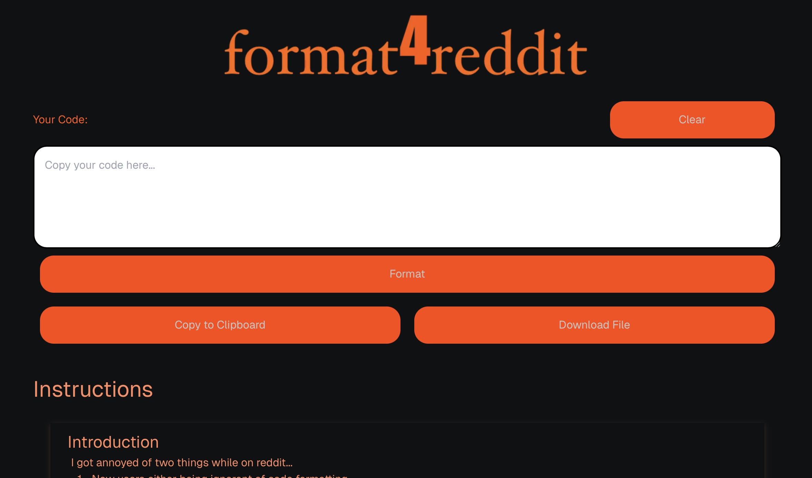

Format4Reddit
=============

Web Url: [Format4Reddit](https://format4reddit.vercel.app)

# Introduction

I got annoyed of two things while on reddit...
1. New users either being ignorant of code formatting
2. Code formatting being annoying, especially on mobile

Enter Format4Reddit which is a dead simple tool for formatting 

## How It Works
This is a very _simple_ tool which just takes your text input and adds four (4) spaces to the beginning of each line.

The formatting is very simple but either people dont do it or its annoying to do on mobile.

Now with this tool, this is no excuse:

1.  Enter your code
2.  Format It
3.  Copy the Formatted Code
4.  Make your Post

## Screenshot

